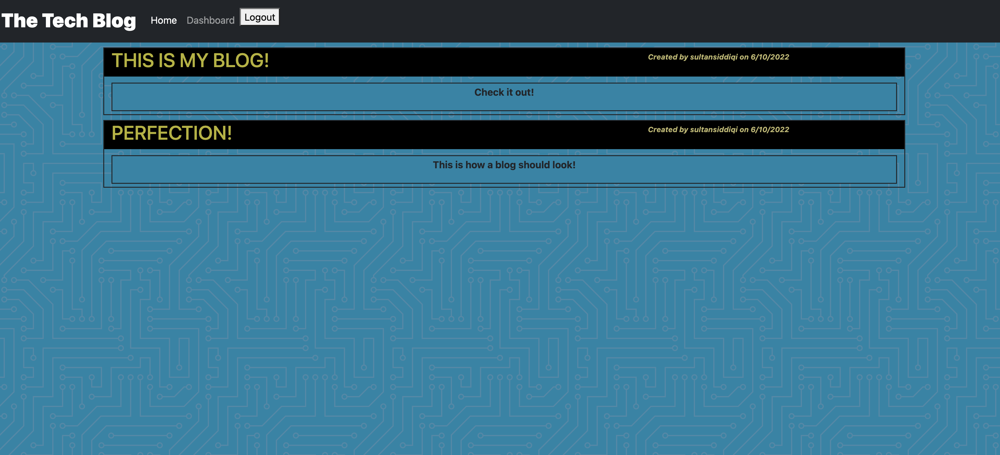

# 14 Model-View-Controller (MVC): Tech Blog

## Description

This app uses many different files, DB's, and tools to create a Tech Blog. A user can see any blogs on the main page and click them to view comments. Both authors of posts and comments will be visible.

A user can create their own blog by signing up and creating an account. Alternatively they can log into an existing one.
Once they are  logged in, they now have access to a dashboard for posting blogs. They can also go to other blogs and comment on them leaving their name and a date. 

The user then can logout and end their session or a timeout exists on the session as well. 
   

[Heroku Link here!](https://fast-basin-66353.herokuapp.com/)

## Table of Contents
- [Description](#description)
- [Installation](#installation)
- [Usage](#usage)
- [License](#license)
- [Contributors](#contributors)
- [Tests](#tests)
- [Contact](#contact)

## Installation

There are no files to download for this project.

The packages required to run are:
-bcrypt
-connect-session-sequelize
-dotenv
-express
-express-handlebars
-express-session
-mysql2
-sequelize 

A database will need to be created first then seeded wih data. 

## Usage

Then create an account or view the first few blogs and comments.  

## License

Source link for [MIT](https://opensource.org/licenses/MIT)

## Contributors

Sultan Siddiqi

## Tests

There are currently no tests for this application.  

## Contact

[GitHub Profile](https://github.com/sultansiddiqi)

Email Me -- Sultan.siddiqi@gmail.com